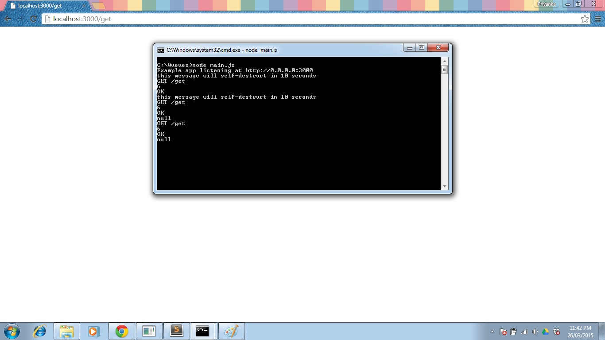

CSC 591 HW 3
--------------------------------

1] SET and GET

As can be seen from the image, the value of the specified key has been set to the string "the message will self-destruct in 10 seconds"

As expected, the string expired to be the value after 10 seconds, which can also be seen from the command window, where the value is printed as null.

2] RECENT

The image above clearly shows the 5 most recent visited urls.

Furthermore, the next image is a result of calling recent again, only once. As can be seen, it is the first url visible, and the 5 most recent urls can be seen.

3] Additional server instance:

As can be seen from the image, 2 instances of the server are running, one on port 3000, and the other on 3001.

